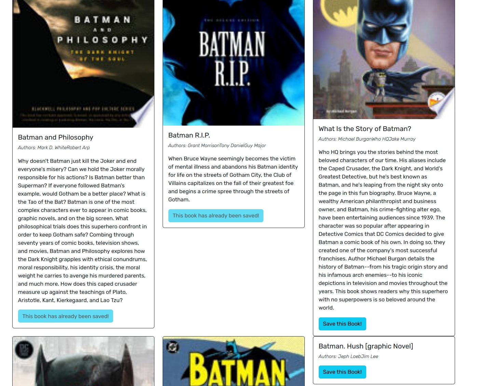

# Book-Search-Engine
A book search site using the Google Books Search API, built with MERN stack, including GraphQL implementations.

A link to the deployed site found [here](https://stormy-forest-93139-5a970274e4ee.herokuapp.com/)

## Screenshot

## Features

- Built with MongoDB, Express, React, Node, GraphQL, and Google Books API.
- Users can create an account with unique username and email and can login with proper authentication via JWT token.
- Each user can search for books and save them to their profiles. The page also notifies users of books that have already been saved before.
- Users can view their book collection via their profile link and can remove each book from said collection.

## Table of Contents 

* [Installation](#installation)

* [Usage](#usage)

* [License](#license)

* [Contributing](#contributing)

* [Tests](#tests)

* [Questions](#questions)

## Installation

To install necessary dependencies, run the following command:
~~~
npm i
~~~

Insert connection link to local MongoDB database into the connection.js file directly or via dotenv

To seed the database, run the follow command:
~~~
npm run seed
~~~

## Usage

Perform a git clone and run the code with 

~~~
npm run develop
~~~

Recommended softwares: 
- MongoDB Compass to see database changes
- Apollo Sandbox to view server-side queries and mutations

## License

MIT

## Contributing

Fork the repo and create pull requests

## Tests

To run tests, run the following command:
~~~
npm test
~~~
## Questions

If you have any questions about the repo, open an issue or contact me directly at Algarvian2001@yahoo.com. You can find more of my works at [NganPham89](https://github.com/NganPham89).

